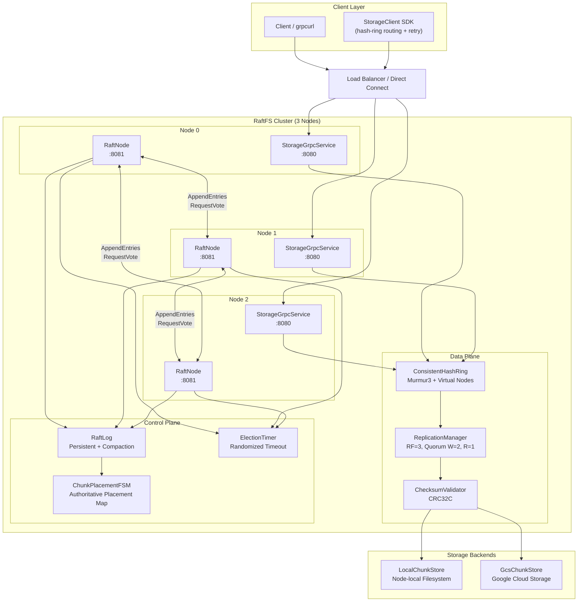

# RaftFS — Fault-Tolerant Distributed Object Storage

RaftFS is a distributed object storage system built with **Java 17** and **Spring Boot 3.2**. It combines a custom **Raft consensus** implementation for control-plane metadata management with **consistent hashing** and **quorum-based replication** for the data plane, delivering strong consistency guarantees and high availability under partial node failures.

## Motivation

Cloud-native applications demand storage systems that remain available and consistent even when individual nodes fail. RaftFS addresses this by separating concerns:

- The **control plane** uses Raft to maintain a linearizable placement map, ensuring every node agrees on where chunks live.
- The **data plane** uses consistent hashing for O(1) client-side routing and parallel quorum writes for durability — no leader lookup required per read.

This separation allows the system to scale the data path independently of the consensus layer, while still guaranteeing read-after-write consistency through quorum overlap.

## Key Features

- **Strong metadata consistency** via Raft leader election and log replication
- **Quorum writes (2/3)** — any two quorums overlap by at least one node, guaranteeing consistency
- **Consistent hashing** with Murmur3 and virtual nodes for deterministic routing and minimal data movement during scaling
- **Pluggable storage backends** — local filesystem (`LocalChunkStore`) or Google Cloud Storage (`GcsChunkStore`)
- **CRC32C integrity validation** on every chunk read to detect silent corruption
- **gRPC-based communication** for both client-facing APIs and inter-node replication
- **Kubernetes-ready** with StatefulSet manifests, stable DNS, and GCS-backed persistence
- **Comprehensive test suite** covering Raft consensus, consistent hashing, and storage layer

## Architecture



## Request Flow

### Write Path (`PutObject`)
1. Client sends `PutObject` to any storage node via gRPC.
2. The node hashes the object key using theconsistent hash ring to determine 3 replica targets.
3. `ReplicationManager` issues parallel `WriteChunk` RPCs to all replica nodes.
4. Each replica writes to its configured `ChunkStore` backend (local disk or GCS).
5. Write succeeds only when **quorum (2/3)** replicas acknowledge.
6. The placement is proposed through Raft and applied to `ChunkPlacementFSM` on all nodes.

### Read Path (`GetObject`)
1. Client sends `GetObject` to any storage node.
2. The node computes replica targets from the hash ring.
3. `ReplicationManager` attempts `ReadChunk` on replicas in ring order.
4. `ChecksumValidator` verifies CRC32C integrity of the returned chunk.
5. Read succeeds as soon as **one valid replica** responds.

### Delete Path (`DeleteObject`)
1. Client sends `DeleteObject` to any storage node.
2. The node issues parallel `DeleteChunk` RPCs to all replica targets.
3. Delete is considered successful on **quorum (2/3)** acknowledgments.

## Core Concepts

| Concept | Description |
|---|---|
| **Raft Consensus** | Custom implementation handling leader election with randomized timers, log replication with `AppendEntries`, and log compaction. Ensures all nodes apply placement changes in identical order. |
| **Consistent Hashing** | Murmur3-based hash ring with configurable virtual nodes per physical node. Provides deterministic key routing and minimizes data movement when nodes join or leave. |
| **Quorum Replication** | Replication factor of 3 with write quorum of 2. Since any two majority quorums overlap by at least one node, this guarantees read-after-write consistency. |
| **ChunkPlacementFSM** | Raft finite state machine that maintains the authoritative chunk-to-node mapping. All placement mutations are linearized through the Raft log. |
| **Storage Abstraction** | `ChunkStore` interface with two implementations — `LocalChunkStore` for development and `GcsChunkStore` for production with cross-zone durability. |
| **CRC32C Validation** | Every chunk read is verified against its stored checksum to detect bit rot and silent corruption. |

## Project Structure

```
src/main/java/com/raftfs/
├── StorageNodeApplication.java      # Spring Boot entry point
├── config/
│   ├── RaftConfig.java              # Raft peer and port configuration
│   └── StorageConfig.java           # Storage backend and replication config
├── raft/                            # Raft consensus implementation
│   ├── RaftNode.java                # Core state machine (leader election, log replication)
│   ├── RaftLog.java                 # Persistent log with compaction support
│   ├── RaftRpcService.java          # gRPC transport for AppendEntries & RequestVote
│   ├── RaftState.java               # Enum: FOLLOWER, CANDIDATE, LEADER
│   ├── LogEntry.java                # Log entry record (term, index, command)
│   ├── ChunkPlacementFSM.java       # FSM applying placement commands from Raft log
│   └── ElectionTimer.java           # Randomized election timeout with jitter
├── ring/
│   └── ConsistentHashRing.java      # Murmur3-based consistent hashing with virtual nodes
├── storage/
│   ├── ChunkStore.java              # Storage backend interface
│   ├── LocalChunkStore.java         # Local filesystem implementation
│   ├── GcsChunkStore.java           # Google Cloud Storage implementation
│   ├── ReplicationManager.java      # RF=3 quorum write/read/delete logic
│   └── ChecksumValidator.java       # CRC32C data integrity validation
├── server/
│   ├── StorageGrpcService.java      # Object storage gRPC request handlers
│   └── GrpcServerRunner.java        # gRPC server lifecycle management
└── client/
    ├── StorageClient.java           # SDK with hash-ring routing and retry logic
    └── StorageGrpcClient.java       # Inter-node gRPC stub wrapper

src/test/java/com/raftfs/
├── raft/
│   ├── RaftNodeTest.java            # Leader election and state transition tests
│   ├── RaftLogTest.java             # Log append, compaction, and persistence tests
│   └── ChunkPlacementFSMTest.java   # Placement map apply and query tests
├── ring/
│   └── ConsistentHashRingTest.java  # Hash distribution and virtual node tests
└── storage/
    ├── ChunkStoreTest.java          # Backend read/write/delete tests
    └── ReplicationManagerTest.java  # Quorum logic and failure scenario tests

k8s/                                 # Kubernetes deployment manifests
├── statefulset.yaml                 # 3-replica StatefulSet with GCS env vars
├── headless-service.yaml            # Headless service for stable DNS
└── configmap.yaml                   # Cluster peer configuration

scripts/
├── cluster_bootstrap.sh             # GKE cluster provisioning script
└── e2e_grpcurl_test.sh              # Local 3-node E2E validation script
```

## gRPC API

### `ObjectStorageService` — Client and inter-node chunk operations

| RPC | Description |
|---|---|
| `PutObject` | Store an object (key + data), replicated to quorum |
| `GetObject` | Retrieve an object by key from any available replica |
| `DeleteObject` | Delete an object from all replicas with quorum ack |
| `WriteChunk` | Inter-node: write a chunk to local storage |
| `ReadChunk` | Inter-node: read a chunk from local storage |
| `DeleteChunk` | Inter-node: delete a chunk from local storage |

### `RaftService` — Peer-to-peer consensus

| RPC | Description |
|---|---|
| `AppendEntries` | Leader replicates log entries to followers |
| `RequestVote` | Candidate requests votes during election |
| `InstallSnapshot` | Transfer compacted state to lagging followers |

Proto definition: [`src/main/proto/storage.proto`](src/main/proto/storage.proto)

## Build and Run

### Prerequisites
- Java 17+
- Maven 3.8+
- Docker (for containerized deployment)
- gcloud CLI (for GKE deployment)
- grpcurl (for gRPC validation)

### Compile and Test
```bash
# Compile the project
mvn clean compile

# Run the full test suite
mvn test

# Run a single node locally
mvn spring-boot:run
```

### Local 3-Node Cluster

Run the E2E test script that builds the project, launches 3 storage nodes, validates core object/chunk operations, and verifies one-node-down quorum behavior:

```bash
chmod +x scripts/e2e_grpcurl_test.sh
./scripts/e2e_grpcurl_test.sh
```

The script configures:
- **Storage ports**: `8080`, `8082`, `8084`
- **Raft ports**: `8085`, `8086`, `8087`
- `STORAGE_PEERS` for data-plane replication targets
- `PEERS` for Raft peer communication

### GKE Deployment
```bash
chmod +x scripts/cluster_bootstrap.sh
./scripts/cluster_bootstrap.sh <gcp-project-id>
```

The bootstrap script provisions a GKE cluster, builds and pushes the Docker image, and deploys the StatefulSet with GCS-backed storage. Kubernetes manifests are under [`k8s/`](k8s/).

## Configuration

| Environment Variable | Default | Description |
|---|---|---|
| `NODE_ID` | `node-0` | Unique identifier for this Raft node |
| `PEERS` | `localhost:8081` | Comma-separated Raft peer addresses |
| `STORAGE_PEERS` | `localhost:8080` | Comma-separated storage gRPC peer addresses |
| `GRPC_PORT` | `8080` | Port for the object storage gRPC service |
| `RAFT_PORT` | `8081` | Port for Raft consensus RPCs |
| `DATA_DIR` | `/data` | Local data directory for `LocalChunkStore` |
| `GCS_BUCKET` | *(empty)* | GCS bucket name (setting this enables GCS backend) |
| `GCS_PROJECT_ID` | *(empty)* | Google Cloud project ID for GCS |

## Failure Handling

| Scenario | Behavior |
|---|---|
| **One node down** | Writes and reads continue — quorum (2/3) is still reachable |
| **Leader failure** | Randomized election timeout triggers new leader election in the Raft control plane |
| **Network partition** | Nodes in the majority partition elect a new leader; minority partition becomes read-only |
| **Corrupted chunk** | CRC32C validation detects corruption; `ReplicationManager` falls back to the next replica |
| **Node recovery** | Recovered node catches up via Raft `AppendEntries` or `InstallSnapshot` if too far behind |

## Design Decisions

1. **Raft for Control Plane, Consistent Hashing for Data Plane** — Raft ensures strong consistency for the chunk placement map while consistent hashing enables O(1) client-side routing without querying the leader for every request.

2. **GCS as Durable Backend** — Each storage node persists chunks to a dedicated GCS bucket, providing cross-zone durability independent of local disk failures. This makes node replacement a stateless operation.

3. **Quorum Writes (W=2 of RF=3)** — Requires majority acknowledgment for writes. Any two quorums overlap by at least one node, guaranteeing that a subsequent read will always find the latest write.

4. **StatefulSets for Stable Identity** — Kubernetes StatefulSets provide stable DNS names (`raftfs-0`, `raftfs-1`, `raftfs-2`) required by Raft for deterministic peer addressing and ordered rolling deployments.

5. **CRC32C over MD5/SHA** — CRC32C is hardware-accelerated on modern CPUs and sufficient for detecting accidental corruption, making it ideal for high-throughput integrity checks on the data path.

## Technology Stack

| Technology | Purpose |
|---|---|
| **Java 17** | Records, sealed classes, pattern matching |
| **Spring Boot 3.2** | Application framework and dependency injection |
| **gRPC + Protobuf** | Inter-node and client-server communication |
| **Raft Consensus** | Custom implementation for leader election and log replication |
| **Consistent Hashing** | Murmur3-based key routing with virtual nodes |
| **Google Cloud Storage** | Durable object persistence backend |
| **Google Kubernetes Engine** | Container orchestration with StatefulSets |
| **Docker** | Multi-stage build for minimal production images |
| **JUnit 5 + Mockito** | Unit and integration testing |
